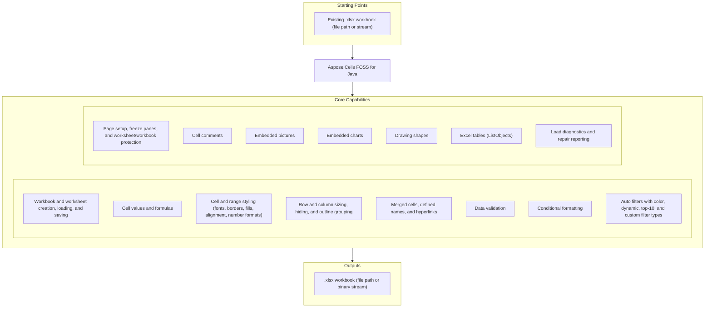

# Aspose.Cells FOSS for Java

[](https://repo1.maven.org/maven2/org/aspose/aspose-cells-foss/) [](https://openjdk.org/projects/jdk/17/) [](License/LICENSE.txt) [](https://github.com/aspose-cells-foss/Aspose.Cells-FOSS-for-Java/graphs/contributors)

[](https://products.aspose.org/cells/java/)

Aspose.Cells FOSS for Java is a free, open-source, pure-Java spreadsheet library for creating,
loading, modifying, and saving Excel `.xlsx` workbooks. It targets Java 17, and keeps OOXML
packaging, XML mapping, and XLSX serialization inside this repository — Apache POI is used only
in `test` scope for compatibility checks, never at runtime. It covers cell values and formulas,
styling, page setup, data validation, conditional formatting, auto filters, comments, embedded
pictures and charts, drawing shapes, and Excel tables (ListObjects). Saving is currently limited
to `.xlsx`.

## Navigation

- [At a Glance](#at-a-glance)
- [Key Capabilities](#key-capabilities)
- [Installation](#installation)
- [Quick Start](#quick-start)
- [Additional Examples](#additional-examples)
- [Project Structure](#project-structure)
- [API Reference](#api-reference)
- [Documentation & Resources](#documentation--resources)
- [Scope and Limitations](#scope-and-limitations)
- [Development and Testing](#development-and-testing)
- [License](#license)

## At a Glance



## Key Capabilities

- Read, write, and edit Excel `.xlsx` workbooks through `Workbook`, which owns a
  `WorksheetCollection` of `Worksheet` objects — add, remove, and rename sheets, select the
  active sheet, and control per-sheet visibility (`SheetVisibility`) through the collection.
  Each worksheet exposes a `Cells` collection of `Cell` objects for reading and writing string,
  numeric, boolean, date/time, and formula values. `LoadOptions` exposes strict-mode toggles and
  package/XML repair, and `Workbook.getLoadDiagnostics()` returns a load diagnostics report —
  repair details and preservation notes for unsupported package parts encountered during the
  load/save flow.
- `Style` carries a cell's full formatting — font, borders, fill, alignment, number format, and
  protection flags — set through `Cell.getStyle()`/`setStyle()`; `NumberFormat` looks up and
  resolves built-in Excel number-format codes.
- Control row and column layout with explicit sizing, hiding, and outline grouping via
  `Row`/`Column`; `Worksheet` itself exposes tab color, zoom, gridline visibility, row/column
  header visibility, zero display, and right-to-left layout.
- Merged cells, defined names (`DefinedNameCollection`), and hyperlinks (`HyperlinkCollection`)
  round-trip through load and save.
- Validate data and apply conditional formatting to worksheet ranges via
  `ValidationCollection` and `ConditionalFormattingCollection`, both scoped to `CellArea`.
- `AutoFilter` supports color filters, dynamic filters, top-10 filters, custom filters, and sort
  conditions on a worksheet range.
- Configure print layout and page setup via `PageSetup`; freeze rows and/or columns by
  coordinate or cell name and inspect or clear the frozen state; lock structure, windows, and
  revisions with separate passwords via `WorksheetProtection`/`WorkbookProtection`, and persist
  window layout and document-level metadata through
  `WorkbookView`/`DocumentProperties`/`WorkbookProperties`.
- Add, edit, and remove cell comments (notes) with author, text, visibility, and size via
  `CommentCollection`, and embed images from bytes, streams, or file paths with two-cell anchor
  positioning via `PictureCollection`, which detects JPEG, PNG, GIF, and BMP formats.
- Create 18 of the 25 real `ChartType` values programmatically via `ChartCollection.add()`; the
  other 7 (the ChartEx types: Waterfall, Treemap, Sunburst, Histogram, Box and Whisker, Funnel,
  and Map) round-trip verbatim from a loaded workbook but cannot be created through the API.
- `ShapeCollection` adds, retrieves, and removes drawing objects across 38 preset geometries
  (`AutoShapeType`; complex shapes loaded from an XLSX file are preserved verbatim), and
  `ListObjectCollection` creates, resizes, styles, and removes structured Excel tables
  (ListObjects), including column definitions and totals rows.
- Configure calculation mode, reference mode, iterative calculation, and precision via
  `CalculationProperties`; formulas and error cell values (`#N/A`, `#VALUE!`, `#REF!`, and
  others) are stored and round-tripped with the correct cell type, but the library is not a
  full spreadsheet calculation engine.

## Installation

Add the dependency to your `pom.xml`:

```xml
<dependency>
  <groupId>org.aspose</groupId>
  <artifactId>aspose-cells-foss</artifactId>
  <version>26.5.0</version>
</dependency>
```

Gradle (Groovy DSL):

```groovy
implementation 'org.aspose:aspose-cells-foss:26.5.0'
```

The library targets Java 17 and depends on Apache POI only in `test` scope, never at runtime.

## Quick Start

Create a workbook, write values, style a cell, and save it:

```java
import org.aspose.cells_foss.Cell;
import org.aspose.cells_foss.Style;
import org.aspose.cells_foss.Workbook;
import org.aspose.cells_foss.Worksheet;

public class Main {
    public static void main(String[] args) {
        try (Workbook workbook = new Workbook()) {
            Worksheet sheet = workbook.getWorksheets().get(0);
            sheet.setName("Report");

            sheet.getCells().get("A1").putValue("Revenue");
            sheet.getCells().get("B1").putValue(12500.75);

            Cell total = sheet.getCells().get("B1");
            Style style = total.getStyle();
            style.getFont().setBold(true);
            style.setCustom("#,##0.00");
            total.setStyle(style);

            sheet.getCells().getRows().get(0).setHeight(22.0);
            sheet.getCells().getColumns().get(1).setWidth(14.5);

            workbook.save("report.xlsx");
        }
    }
}
```

Load an existing workbook with options and inspect load diagnostics:

```java
import org.aspose.cells_foss.LoadIssue;
import org.aspose.cells_foss.LoadOptions;
import org.aspose.cells_foss.Workbook;

public class LoadWorkbook {
    public static void main(String[] args) {
        LoadOptions options = new LoadOptions();
        options.setStrictMode(false);
        options.setTryRepairPackage(true);
        options.setTryRepairXml(true);

        try (Workbook workbook = new Workbook("input.xlsx", options)) {
            if (workbook.getLoadDiagnostics().hasRepairs()) {
                for (LoadIssue issue : workbook.getLoadDiagnostics().getIssues()) {
                    System.out.println(issue.getMessage());
                }
            }

            workbook.getDocumentProperties().setAuthor("cells-foss");
            workbook.save("output.xlsx");
        }
    }
}
```

## Additional Examples

Add data validation and conditional formatting to a range:

```java
import org.aspose.cells_foss.CellArea;
import org.aspose.cells_foss.FormatCondition;
import org.aspose.cells_foss.FormatConditionCollection;
import org.aspose.cells_foss.FormatConditionType;
import org.aspose.cells_foss.OperatorType;
import org.aspose.cells_foss.Style;
import org.aspose.cells_foss.Validation;
import org.aspose.cells_foss.ValidationType;
import org.aspose.cells_foss.Workbook;
import org.aspose.cells_foss.Worksheet;

public class RulesExample {
    public static void main(String[] args) {
        try (Workbook workbook = new Workbook()) {
            Worksheet sheet = workbook.getWorksheets().get(0);

            int validationIndex = sheet.getValidations().add(new CellArea(1, 0, 10, 1));
            Validation validation = sheet.getValidations().get(validationIndex);
            validation.setType(ValidationType.WHOLE_NUMBER);
            validation.setOperator(OperatorType.BETWEEN);
            validation.setFormula1("1");
            validation.setFormula2("100");

            int cfIndex = sheet.getConditionalFormattings().add();
            FormatConditionCollection conditions = sheet.getConditionalFormattings().get(cfIndex);
            conditions.addArea(CellArea.createCellArea("B2", "B11"));
            int conditionIndex = conditions.addCondition(
                    FormatConditionType.CELL_VALUE,
                    OperatorType.BETWEEN,
                    "1",
                    "100");

            FormatCondition condition = conditions.get(conditionIndex);
            Style style = condition.getStyle();
            style.getFont().setBold(true);
            condition.setStyle(style);

            workbook.save("rules.xlsx");
        }
    }
}
```

## Project Structure

The public API lives under `src/main/java/org/aspose/cells_foss/`, with integration tests,
unit tests, and generated Javadoc alongside it at the repository root:

```
├── src/main/java/org/aspose/cells_foss/  # Public API: Workbook, Worksheet, Cell, Style, collections, enums, load/save options
│   ├── core/                             #   Internal workbook, worksheet, style, validation, metadata, and packaging models
│   ├── packaging/                        #   OOXML package and relationship abstractions
│   ├── xml/                              #   XML mappers and parsing helpers
│   └── validation/                       #   Workbook validation messages and validation helpers
├── src/test/java/org/aspose/cells_foss/  # Scenario-driven integration tests for workbook behavior and XLSX round-tripping
│   └── unit/                             #   Fast, focused unit tests for individual API classes without XLSX I/O
└── docs/apidocs/                         # Generated HTML Javadoc for the public API (run `mvn javadoc:javadoc` to regenerate)
```

## API Reference

The public entry point is `org.aspose.cells_foss`. The classes below cover the full supported
public API surface — 183 public types organized into one module.

<details>
<summary>View the Supported Public API Surface</summary>

### Core API

| Class | Description |
|---|---|
| `AlignmentValue` | Represents alignment settings for a cell style. |
| `AutoFilter` | Represents an auto-filter in a worksheet. |
| `AutoFilterColorFilter` | Represents the AutoFilterColorFilter component. |
| `AutoFilterColorFilterModel` | Represents the AutoFilterColorFilterModel component. |
| `AutoFilterCriteria` | Represents auto-filter criteria for filtering data in a worksheet. |
| `AutoFilterCustomFilter` | Represents the AutoFilterCustomFilter component. |
| `AutoFilterCustomFilterCollection` | Represents the AutoFilterCustomFilterCollection component. |
| `AutoFilterCustomFilterModel` | Represents the AutoFilterCustomFilterModel component. |
| `AutoFilterDynamicFilter` | Represents the AutoFilterDynamicFilter component. |
| `AutoFilterDynamicFilterModel` | Represents the AutoFilterDynamicFilterModel component. |
| `AutoFilterModel` | Represents a model for auto-filter configuration in Excel. |
| `AutoFilterSortCondition` | Represents the AutoFilterSortCondition component. |
| `AutoFilterSortConditionCollection` | Represents the AutoFilterSortConditionCollection component. |
| `AutoFilterSortConditionModel` | Represents the AutoFilterSortConditionModel component. |
| `AutoFilterSortState` | Represents the AutoFilterSortState component. |
| `AutoFilterSortStateModel` | Represents the AutoFilterSortStateModel component. |
| `AutoFilterSupport` | Provides utility methods for auto-filter support. |
| `AutoFilterTop10` | Represents the AutoFilterTop10 component. |
| `AutoFilterTop10Model` | Represents the AutoFilterTop10Model component. |
| `Border` | Represents a border with line style and color. |
| `BorderSideValue` | Represents a border side value with style and color. |
| `Borders` | Represents the border properties for a cell or range in an Excel worksheet. |
| `BordersValue` | Represents the border values for a cell style, including left, right, top, bottom, and diagonal borders, as well as diagonal direction flags. |
| `CalculationProperties` | Represents workbook calculation settings. |
| `CalculationPropertiesModel` | Represents the CalculationPropertiesModel component. |
| `Cell` | Represents a cell in a worksheet. |
| `CellAddress` | Represents a cell address with row and column indices. |
| `CellArea` | Represents a cell area with row and column bounds. |
| `CellFormatValue` | Inner class representing cell format value. |
| `CellRecord` | Represents a cell record in the Excel file. |
| `Cells` | Represents a collection of cells in a worksheet. |
| `CellsException` | Represents an exception thrown by the Aspose.Cells library. |
| `Chart` | Represents an embedded chart in a worksheet (read-only; charts are round-tripped verbatim). |
| `ChartCollection` | Collection of embedded charts on a worksheet. |
| `ChartModel` | Internal model for an embedded chart. |
| `Color` | Represents an ARGB color value. |
| `ColorValue` | Represents a color value with alpha, red, green, and blue components. |
| `Column` | Represents a column in a worksheet. |
| `ColumnCollection` | Represents a collection of columns in a worksheet. |
| `ColumnRangeModel` | Represents a range of columns with formatting properties. |
| `Comment` | Represents a cell comment (note). |
| `CommentCollection` | Collection of cell comments on a worksheet. |
| `CommentModel` | Internal model for a cell comment (note). |
| `ConditionalFormattingCollection` | A collection of conditional formatting objects. |
| `ConditionalFormattingModel` | Represents the conditional formatting model for a worksheet. |
| `CoreDocumentPropertiesModel` | Represents the CoreDocumentPropertiesModel component. |
| `DateSerialConverter` | Converts between LocalDateTime values and Excel serial date numbers. |
| `DefinedName` | Represents a defined name in the workbook. |
| `DefinedNameCollection` | Represents a collection of defined names in a workbook. |
| `DefinedNameModel` | Represents a defined name model in the Excel file. |
| `DiagnosticBag` | Represents a bag of diagnostic entries. |
| `DiagnosticEntry` | Represents a diagnostic entry with details about a problem or warning. |
| `DisplayFormatSectionInfo` | Holds metadata about a single section of a number format code string. |
| `DisplayTextFormatterSupport` | Internal utility class for selecting and formatting display text sections. |
| `DocumentProperties` | Represents the document properties of a workbook (docProps/core.xml and docProps/app.xml). |
| `DocumentPropertiesModel` | Represents the document properties model for an Excel file. |
| `ExtendedDocumentPropertiesModel` | Represents the ExtendedDocumentPropertiesModel component. |
| `FillValue` | Inner class representing fill value. |
| `FilterColumn` | Represents the FilterColumn component. |
| `FilterColumnCollection` | Represents the FilterColumnCollection component. |
| `FilterColumnModel` | Represents the FilterColumnModel component. |
| `FilterValueCollection` | Represents the FilterValueCollection component. |
| `Font` | Represents a font with its properties. |
| `FontValue` | Represents a font value with its properties. |
| `FormatCondition` | Represents a conditional formatting rule. |
| `FormatConditionCollection` | Represents a collection of format conditions in Excel. |
| `FormatConditionModel` | Represents a format condition model used in Excel conditional formatting. |
| `FormulaException` | Represents an exception that occurs during formula processing. |
| `HeaderFooterModel` | Represents the header and footer model for a worksheet. |
| `Hyperlink` | Represents a hyperlink in a worksheet. |
| `HyperlinkCollection` | Represents a collection of hyperlinks in a worksheet. |
| `HyperlinkModel` | Represents a hyperlink model with its properties. |
| `InvalidFileFormatException` | Represents an exception thrown when an invalid file format is encountered. |
| `ListColumn` | Represents a column within an Excel table (ListObject). |
| `ListColumnCollection` | Ordered collection of columns in an Excel table. |
| `ListColumnModel` | Internal model for a table (ListObject) column. |
| `ListObject` | Represents an Excel table (structured reference / ListObject). |
| `ListObjectCollection` | Collection of Excel tables (ListObjects) on a worksheet. |
| `ListObjectModel` | Internal model for a table (ListObject / structured reference). |
| `LoadDiagnostics` | Represents diagnostics information during workbook loading. |
| `LoadIssue` | Represents an issue that occurred during workbook loading. |
| `LoadOptions` | Represents options for loading a workbook. |
| `MergeRegion` | Represents a merge region in an Excel worksheet. |
| `MissingPartException` | Thrown when a required part is missing from the package structure. |
| `NumberFormat` | Provides built-in number format functionality. |
| `NumberFormatValue` | Represents a number format value with its number format index and custom format string. |
| `PackageLoadContext` | Represents the context for loading a package. |
| `PackageModel` | Represents the model of a package (e.g., XLSX file structure) with parts, relationships, and unsupported parts. |
| `PackagePartDescriptor` | Represents a descriptor for a package part in the XLSX package. |
| `PackageStructureException` | Thrown when the package structure of the Excel file is invalid. |
| `PackagingConventions` | Defines constants for Open XML package part paths and relationship types. |
| `PageMarginsModel` | Represents page margins for a worksheet in an Excel file. |
| `PageSetup` | Represents page setup options for a worksheet. |
| `PageSetupModel` | Represents page setup model for an Excel worksheet. |
| `Picture` | Represents an embedded image in a worksheet. |
| `PictureCollection` | Collection of embedded pictures on a worksheet. |
| `PictureModel` | Internal model for an embedded picture/image. |
| `PrintOptionsModel` | Represents print options for a worksheet. |
| `ProtectionValue` | Represents protection settings for a cell or range. |
| `RelationshipDescriptor` | Represents a relationship descriptor in the XLSX package. |
| `RelationshipResolutionException` | Exception thrown when a relationship cannot be resolved in the package structure. |
| `Row` | Represents a row in a worksheet. |
| `RowCollection` | Represents a collection of rows in a worksheet. |
| `RowModel` | Represents a row model in the Excel file. |
| `SaveOptions` | Represents save options for workbook saving. |
| `Shape` | Represents a drawing object (auto shape) anchored to a worksheet. |
| `ShapeCollection` | Collection of drawing objects (shapes) on a worksheet. |
| `ShapeModel` | Internal model for a drawing object (auto shape) anchored to a worksheet. |
| `SharedStringRepository` | A repository that manages shared strings for Excel files. |
| `SharedStringTableXmlMapper` | Maps shared string tables to/from XML. |
| `Style` | Represents the full style of a cell: font, borders, alignment, fill, number format, and protection. |
| `StyleException` | Represents an exception that occurs during style processing. |
| `StyleRepository` | Represents a repository for style values. |
| `StyleValue` | Represents a style value with various formatting properties. |
| `StyleValueSanitizer` | Sanitizes style values to ensure they fall within valid ranges. |
| `StylesheetXmlMapper` | Maps style information to and from XML. |
| `UnsupportedFeatureException` | Thrown when an unsupported feature is encountered. |
| `Validation` | Represents a data validation rule applied to one or more cell areas. |
| `ValidationCollection` | Represents the collection of data validation rules for a worksheet. |
| `ValidationMessage` | Represents a validation message with code, severity, and message text. |
| `ValidationModel` | Represents a data validation model in the Excel file. |
| `WarningInfo` | Represents information about a warning that occurred during workbook operations. |
| `Workbook` | Represents an Excel workbook. |
| `WorkbookLoadException` | Represents an exception that occurs when loading a workbook. |
| `WorkbookModel` | Represents the top-level model of a workbook. |
| `WorkbookProperties` | Represents the properties of a workbook (workbookPr attributes). |
| `WorkbookPropertiesModel` | Represents the workbook properties model. |
| `WorkbookProtection` | Represents workbook-level protection settings (structure, windows, revision). |
| `WorkbookProtectionModel` | Represents the WorkbookProtectionModel component. |
| `WorkbookSaveException` | Represents an exception that occurs when saving a workbook. |
| `WorkbookSettings` | Represents workbook settings for an Excel file. |
| `WorkbookSettingsModel` | Represents workbook settings model. |
| `WorkbookValidator` | A validator for workbook models that produces validation messages. |
| `WorkbookView` | Represents the view / window settings stored in &lt;bookViews&gt;. |
| `WorkbookViewModel` | Represents the WorkbookViewModel component. |
| `WorkbookXmlMapper` | Maps workbook data to/from SpreadsheetML XML format. |
| `Worksheet` | Represents a worksheet in a workbook. |
| `WorksheetCollection` | Represents a collection of worksheets in a workbook. |
| `WorksheetModel` | Represents the model of a worksheet in the Excel file. |
| `WorksheetProtection` | Represents protection settings for a worksheet. |
| `WorksheetProtectionModel` | Represents the protection model for a worksheet in an Excel file. |
| `WorksheetViewModel` | Represents a view model for a worksheet with display settings. |
| `WorksheetXmlMapper` | Maps worksheet XML data. |
| `XlsxDocumentProperties` | Helper class for handling XLSX document properties (core and extended). |
| `XlsxWorkbookSerializer` | Serializer for XLSX workbook files — thin coordinator that delegates to helper classes. |
| `XlsxWorkbookStylesValueHelpers` | Provides helper methods for parsing and formatting workbook style values. |
| `XlsxWorkbookStylesXml` | Provides methods for reading and writing XLSX workbook styles XML. |
| `XmlParsingException` | Represents an exception that occurs during XML parsing. |

#### Interfaces

| Interface | Description |
|---|---|
| `IPackageReader` | Provides a reader interface for reading package models from streams. |
| `IPackageWriter` | Provides a contract for writing package models to a stream. |
| `IWarningCallback` | Provides a callback mechanism for reporting warnings during workbook operations. |

#### Enumerations

| Enumeration | Description |
|---|---|
| `AutoShapeType` | Specifies the type of an auto shape (preset DrawingML geometry). |
| `BorderStyle` | Represents the style of a border line in a cell. |
| `BorderStyleType` | Represents the style of a border. |
| `CellValueKind` | Represents the kind of a cell value. |
| `CellValueType` | Represents the type of a cell value. |
| `ChartType` | Identifies the type of an embedded chart. |
| `DateSystem` | Represents the date system used in Excel. |
| `DiagnosticSeverity` | Represents the severity level of a diagnostic message (public `org.aspose.cells_foss` API). |
| `DiagnosticSeverity-core` | Represents the severity of a diagnostic entry (internal `org.aspose.cells_foss.core` engine layer, a distinct enum). |
| `FillPattern` | Represents the fill pattern used in cell styling. |
| `FillPatternKind` | Represents the pattern used to fill a cell. |
| `FilterOperatorType` | Enumerates the supported FilterOperatorType values. |
| `FormatConditionType` | Represents the type of a format condition. |
| `HorizontalAlignment` | Represents horizontal alignment options for cell content in Excel. |
| `HorizontalAlignmentType` | Represents the type of horizontal alignment for cell content. |
| `ImageType` | Identifies the format of an embedded image. |
| `LoadFormat` | Specifies the format of the workbook to be loaded. |
| `OperatorType` | Represents the operator type used in conditional formatting and filtering. |
| `PageOrientation` | Represents the page orientation for a worksheet. |
| `PageOrientationType` | Represents the page orientation type for a worksheet. |
| `PaperSizeType` | Represents the paper size type for a worksheet. |
| `SaveFormat` | Specifies the format in which a workbook will be saved. |
| `SheetVisibility` | Represents the visibility state of a worksheet in an Excel workbook. |
| `TableStyleType` | Identifies a built-in Excel table style. |
| `TargetModeType` | Represents the target mode type for cell references. |
| `TotalsCalculation` | Aggregation function applied to a table's totals row. |
| `ValidationAlertType` | Represents the alert type for data validation. |
| `ValidationMessageSeverity` | Represents the severity level of a validation message. |
| `ValidationType` | Represents the type of cell validation. |
| `VerticalAlignment` | Represents vertical alignment options for cell content. |
| `VerticalAlignmentType` | Represents vertical alignment options for cell content. |
| `VisibilityType` | Represents the visibility type of a worksheet. |

</details>

## Documentation & Resources

- **[Getting started guide](https://docs.aspose.org/cells/java/)** — Java documentation for Aspose.Cells FOSS: workbook creation, cell operations, styling, and data validation.
- **[How-to guides & FAQ](https://kb.aspose.org/cells/java/)** — Java knowledge base for Aspose.Cells FOSS: how-to articles, FAQ, and troubleshooting guides.
- **[Full API reference](https://reference.aspose.org/cells/java/)** — the complete, browsable reference for all 183 public types (the [API reference](#api-reference) section above covers the essentials).
- **[Contributor guide](Agents.md)** — repository conventions to follow when changing supported behavior.
- **[Publishing guide](PUBLISHING.md)** — how releases are built and published to Maven Central.
- Found a bug or have a feature request? [Open an issue](https://github.com/aspose-cells-foss/Aspose.Cells-FOSS-for-Java/issues) on GitHub.

## Scope and Limitations

- Saving is currently limited to `.xlsx`.
- ChartEx types (Waterfall, Treemap, Sunburst, Histogram, Box and Whisker, Funnel, and Map) cannot
  be created programmatically; charts of these types loaded from an existing workbook are
  preserved verbatim across load and save.
- Formulas are stored and round-tripped, but the library is not a full spreadsheet calculation
  engine.
- A handful of public XML-mapper classes are unimplemented skeleton code carried over from an
  early scaffold — their own class-level Javadoc discloses this, and the library's real save/load
  path never calls them.
- Some APIs exist mainly to preserve OOXML metadata and package fidelity rather than to provide
  full Excel feature parity.

These limitations don't apply to
[Aspose.Cells for Java — Enterprise Edition](https://products.aspose.com/cells/java/), which adds
additional spreadsheet save formats beyond `.xlsx`, a full formula calculation engine, ChartEx
chart type creation, and dedicated enterprise support.

## Development and Testing

Requires JDK 17+ and Maven as the build tool (3.9+). Run the test suite:

```bash
mvn test
```

Other common commands:

```bash
mvn compile
mvn clean package
mvn javadoc:javadoc   # generates docs/apidocs/index.html
```

Releases publish to Maven Central via
[`maven-central-release.yml`](.github/workflows/maven-central-release.yml) — see
[`PUBLISHING.md`](PUBLISHING.md) for the full release process.

## License

This project is licensed under the [MIT License](License/LICENSE.txt). The MIT License permits
use, copying, modification, distribution, sublicensing, and commercial use, provided its
copyright and permission notice are retained. The software is provided without warranty.
